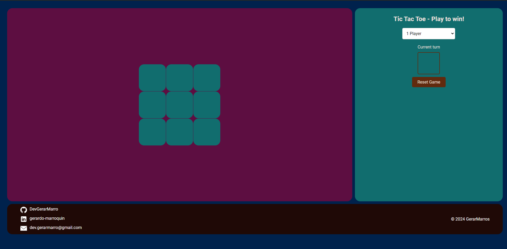

# Tic Tac Toe (X 0) 🙃


This project implements the classic Tic-Tac-Toe game using HTML, CSS, and JavaScript. The game allows a human player to play against a computer that makes automatic and strategic moves. The computer not only makes random moves but also tries to block the player's potential wins and seizes opportunities to win.

*Este proyecto implementa un juego clásico de Tic-Tac-Toe (X 0) utilizando HTML, CSS y JavaScript. El juego permite que un jugador humano juegue contra una computadora que realiza movimientos automáticos y estratégicos. La computadora no solo hace movimientos aleatorios, sino que también intenta bloquear las posibles victorias del jugador y aprovecha las oportunidades para ganar.*

## Features (Características)



**Interactive User Interface**:

1. **Board**: A 3x3 grid board where players can click on cells to make their moves.
2. **Settings Panel**: A very simple container with the necessary settings so the user can play with a friend or against the computer, also in case you want to reset the game and check the current turn.
3. **Footer**: The footer onlu displays my information so you can contact me or check my other cool projects.

***Interfaz de Usuario Interactiva** :*

1. ***Tablero** : Un tablero de 3x3 donde los jugadores pueden hacer clic en las celdas para realizar sus movimientos.*
2. ***Panel de Configuración** : Un contenedor muy sencillo con los ajustes necesarios para que el usuario pueda jugar con un amigo o contra la computadora, además de la opción para reiniciar el juego y ver el turno actual.*
3. ***Pie de Página** : El pie de página muestra únicamente mi información para que puedas contactarme o ver mis otros proyectos interesantes.*

# Links 🔗

[](https://www.linkedin.com/in/gerardo-marroquin/)[](https://github.com/DevGerarMarro)

# Deploy on Local (Desplegar en local)

To deploy on your local is so easy that you only need to clone the repo and go to the index.html page.

*Para desplegar en local es tan simple como clonar el repositorio e ir a index.html*

```
git clone https://github.com/DevGerarMarro/tic-tac-toe.git
```

# Technologies (Tecnologías)

[HTML5](https://developer.mozilla.org/es/docs/Web/HTML)

[CSS](https://developer.mozilla.org/es/docs/Web/CSS)

[JavaScript](https://developer.mozilla.org/es/docs/Web/JavaScript)

# Screenshots (Capturas de pantalla)


